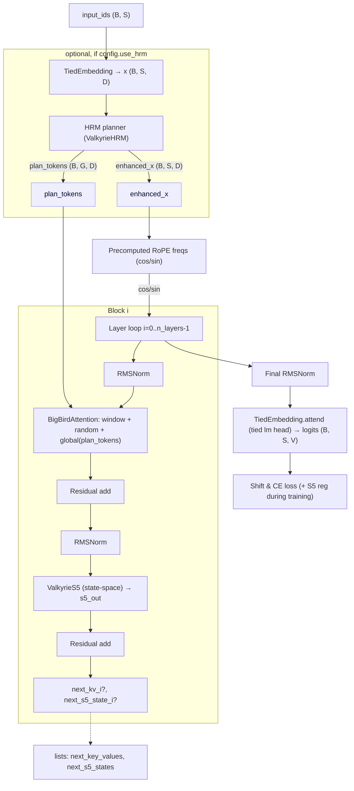

# Valkyrie (W.I.P)

Valkyrie is a language model designed for efficient, hierarchical reasoning. It fuses a sparse BigBird-style attention backbone with state-space S5 residual pathways and a small, planner-like HRM (Hierarchical Reasoning Module) that emits **plan tokens** to steer global attention. The goal is not raw scale but disciplined reasoning: carry per-layer state, expose planning tokens as globals, and keep training tractable on TPU or equivalent hardware.

---

## Quick highlights

* **Architecture:** `ValkyrieModel` = `TiedEmbedding` → `n_layers` × (BigBirdAttention + ValkyrieS5) → `RMSNorm` → tied LM head.
* **Fusion idea:** BigBird (sparse global/window/random attention) + S5 residual state-space modules for long-range, stable signal propagation + HRM planner that writes global plan tokens every forward.
* **Shapes used in the repo:** `d_model = 1536`, `n_heads = 24`, `head_dim = 64`.
* **Framework & infra:** developed for JAX / Flax with Optax optimizers; trained and prototyped on TPU v4 families (v4-8 → v4-32).
* **Major adjustments** rewrote S5 to work for JAX without the need for CUDA, as well as converting HRM to a JAX-compatible base
---

## Why this design

People chase parameter counts. We chase *structured memory and planning*. The S5 path gives per-layer carryable state that behaves like a long-term integrator; BigBird lets us scale attention sparsely; HRM lets the model explicitly plan with a small set of global tokens that every block can consult. The result is a model that reasons in stages rather than merely pattern-completing. Of course it's a WIP research.

---

## Architecture (high level)

* **TiedEmbedding** — standard token + positional embed (RoPE) with RMS-style normalization.
* **ValkyrieHRM** — small transformer/ hierarchical module that reads a sequence summary and emits:

  * `plan_tokens` (B, G, D) → injected as **global tokens** into every BigBirdAttention layer; and
  * `enhanced_x` (B, S, D) → optionally replaces the input embeddings to condition the stack.
* **BigBirdAttention** — q/k/v/o projections plus block-window + random + global patterns. HRM plan tokens are exactly the `global` set.
* **ValkyrieS5** — per-layer SSM-based residual module that keeps and updates a complex internal state and outputs a *real* residual contribution.
* **RMSNorm** and tied output projection produce logits; loss is standard shifted cross-entropy with optional S5 regularizers.

---

Below are four diagrams (plus shape notes) showing the full story:

* whole-model forward (training)
* one transformer block (BigBird → S5 with residuals)
* HRM planning and how its “plan tokens” flow into BigBird as globals
* generation/inference with KV cache + S5 state carry

---

# whole-model forward pass (training)

(See full diagrams block in repo for more detail.)

---

## Training & inference notes

* **Training:** next-token CE with optional S5 regularizers (imag/ symmetry terms) to stabilize complex internals. HRM runs once per forward and is cheap compared to the stack.
* **Inference:** KV cache for BigBird present_kv per-layer + carryable `s5_state` per-layer. HRM can be run at intervals or carried forward depending on config.
* **Hardware:** prototyped on small TPU slices; scale training on v4-32 for usable checkpoints.

---

## References & further reading

* BigBird (sparse attention): [https://arxiv.org/abs/2007.14062](https://arxiv.org/abs/2007.14062)
* S5 / structured state-space models: [https://arxiv.org/abs/2111.00396](https://arxiv.org/abs/2111.00396) (and follow-ups)
* Mermaid diagrams: [https://mermaid.js.org](https://mermaid.js.org)
* JAX / Flax / Optax: [https://github.com/google/jax](https://github.com/google/jax), [https://github.com/google/flax](https://github.com/google/flax), [https://github.com/deepmind/optax](https://github.com/deepmind/optax)
* HRM (Hierarchical Reasoning Model): [https://github.com/sapientinc/HRM](https://github.com/sapientinc/HRM), [https://arxiv.org/abs/2506.21734](https://arxiv.org/abs/2506.21734)

---

## Status & contribution

WIP — experimental. I built on the older, broken repository [https://github.com/leonalav/valkyriebeta](https://github.com/leonalav/valkyriebeta). If you want to help: open issues, or contribute tests for KV + S5 state carry. Pull requests welcome; write tests and match repo naming.

---

## Citations

Will implement in Phase 2, latter states.

## License

MIT

## Contacts

For research inquiries or other matters, please reach out via email at  
**duchuypm@gmail.com** or **ravkeave@gmail.com**.

## P/S: regarding papers
The researcher in charge (me!) is a high school student. Research credentials and papers for this model will temporarily not be available.

